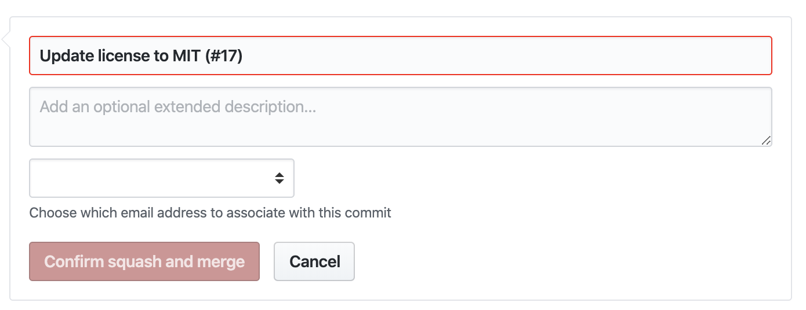
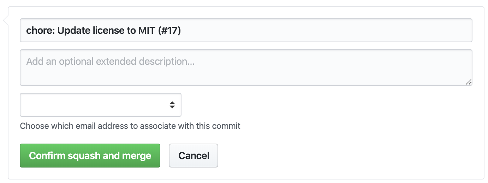
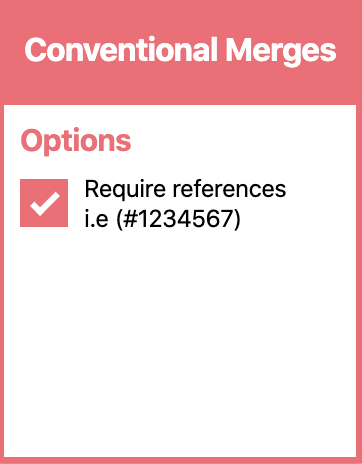

# Conventional Merges

Merge confidently with this chrome extension that ensures your commits follow the [conventional commit specification](https://www.conventionalcommits.org/). How does it work?

## Usage

Download [Conventional Merges](<(https://chrome.google.com/webstore/detail/conventional-merges/bnpeagecgekcbeaniedbepadngcjlhgp)>) from the chrome web store.

### Open a Github Pull Request

#### **Bad**

#### **Good**

### Options

## Contributing

We would love to build on this initial implementation with your help! Please read our contribution guide (coming soon)

### License

MIT © [HomeX Labs](https://github.com/homexlabs)
